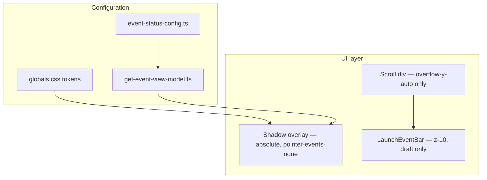

# Content Panel Inner Shadow — Implementation Guide

This document captures how the status-driven inner shadow on the event detail content panel was built, common pitfalls we hit, and how to adjust or extend it. Hand this to devs implementing the same pattern in production.

---

## What it does

A subtle **inset glow** around the scrollable content area that reflects event status:

| Status | Shadow token | Visual |
|--------|----------------|--------|
| `draft` | `--content-panel-inner-shadow-draft` | Blue glow (`#C1DFFD` family) |
| `pending_approval` | `--content-panel-inner-shadow-pending` | Warm glow (`--status-pending-action-bg`, `#feebc8`) |
| `live` / `cancelled` | `--content-panel-inner-shadow-none` | Fades out (transparent) |

The shadow **crossfades** when status changes (draft → pending → live), using a 500ms `box-shadow` transition.

**Figma reference (draft):**

```css
box-shadow: inset 0px 0px 40px 4px #C1DFFD;
```

Current tuned values in the repo may differ (e.g. smaller blur); adjust in `globals.css`.

---

## Architecture



**Do not** put `box-shadow` on the scroll container. Use a **separate overlay** sibling instead (see Scrollbar section below).

---

## File map

| File | Responsibility |
|------|----------------|
| [`src/styles/globals.css`](../src/styles/globals.css) | Shadow **values** (`--content-panel-inner-shadow-*`) |
| [`src/config/event-status-config.ts`](../src/config/event-status-config.ts) | Which status uses which token (`contentPanelInnerShadow`) |
| [`src/types/event.ts`](../src/types/event.ts) | `EventViewModel.contentPanelInnerShadow` |
| [`src/lib/get-event-view-model.ts`](../src/lib/get-event-view-model.ts) | Maps config → view model |
| [`src/lib/content-panel-inner-shadow-classes.ts`](../src/lib/content-panel-inner-shadow-classes.ts) | Overlay layout + transition classes; `getContentPanelInnerShadowValue()` |
| [`src/pages/event-detail-page.tsx`](../src/pages/event-detail-page.tsx) | DOM structure: scroll layer + overlay |

---

## DOM structure (required)

The scrollable region and shadow must be **siblings** inside a `relative` wrapper:

```tsx
<div className="relative min-h-0 flex-1">
  {/* 1. Scroll — no box-shadow here */}
  <div className="h-full min-h-0 overflow-y-auto px-6 pt-6 pb-6">
    {/* page content */}
  </div>

  {/* 2. Shadow overlay — always mounted for transitions */}
  <div
    aria-hidden
    className={contentPanelInnerShadowOverlayClass}
    style={{
      boxShadow: getContentPanelInnerShadowValue(viewModel.contentPanelInnerShadow),
    }}
  />
</div>
```

**Launch bar** (draft only) sits **outside** this wrapper, `absolute bottom-0 z-10`, so it stays above the shadow overlay (`z-[1]`).

When the launch bar is visible, add extra bottom padding on the scroll div (e.g. `pb-[88px]`) so content is not hidden under the sticky footer.

---

## Adjusting the shadow look

Edit **only** these variables in `globals.css`:

```css
--content-panel-inner-shadow-draft: inset 0px 0px 16px 2px rgba(193, 223, 253, 0.5);
--content-panel-inner-shadow-pending: inset 0px 0px 16px 2px var(--status-pending-action-bg);
--content-panel-inner-shadow-none: inset 0px 0px 0px 0px transparent;
```

| Parameter | Effect |
|-----------|--------|
| `0px 0px` | Offset (usually keep at 0 for even glow) |
| Third value (`16px` / `40px`) | Blur radius — larger = softer, wider glow |
| Fourth value (`2px` / `4px`) | Spread — larger = thicker edge band |
| Color | Draft blue vs pending warm |

To assign shadow to a new status, set `contentPanelInnerShadow` in `event-status-config.ts` to a new `--content-panel-inner-shadow-*` token name (or `null` for no glow).

---

## Pitfall 1: Tailwind dynamic classes are stripped

**Wrong** — class string built at runtime; Tailwind JIT never emits CSS:

```tsx
// ❌ Does not work — no utility in built CSS
className={`shadow-[var(${viewModel.contentPanelInnerShadow})]`}
```

**Right** — use **inline `style.boxShadow`** with CSS variables (current approach), or **static** full class names in source:

```tsx
// ✅ Inline style (current)
style={{ boxShadow: getContentPanelInnerShadowValue(viewModel.contentPanelInnerShadow) }}

// ✅ Or static classes (must appear literally in source files)
viewModel.status === "draft" && "shadow-[var(--content-panel-inner-shadow-draft)]"
```

After changes, verify the built CSS contains your utility:

```bash
grep content-panel-inner-shadow dist/assets/*.css
```

You should see both the `:root` variable **and** a rule applying it (or inline styles in the component).

---

## Pitfall 2: Scrollbar hides the inner shadow

**Problem:** Applying `box-shadow` + `overflow-y-auto` on the **same** element causes the native scrollbar to paint over the right-edge glow. Overflow clipping can also weaken inset shadows.

**Fix:** **Overlay pattern** (same idea as [`performance-metric-card.tsx`](../src/components/event-detail/performance-metric-card.tsx)):

1. Inner div: scroll only (`overflow-y-auto`), no shadow.
2. Sibling overlay: `absolute inset-0`, `pointer-events-none`, `z-[1]`, carries `box-shadow`.

The scrollbar stays on the scroll layer; the glow sits on top of the viewport frame and remains visible on all four edges.

```
┌─────────────────────────────┐
│  overlay (inset shadow)     │  ← pointer-events-none, z-1
│  ┌───────────────────────┬──┤
│  │ scrollable content    │██│  ← scrollbar on scroll div only
│  └───────────────────────┴──┤
└─────────────────────────────┘
```

---

## Pitfall 3: Shadow “invisible” on white background

If the overlay sits on solid white (`--color-1`) **without** scrolling content behind the fade, a white→transparent gradient or subtle blue glow can look like a flat white bar.

- The glow is most visible at the **edges** of the panel and when **content** scrolls under the overlay.
- Increase blur, spread, or color contrast in `globals.css` if the effect is too subtle.
- Confirm you are testing in **draft** or **pending** (default app status may be `live`, which uses the “none” token).

---

## Smooth transitions between statuses

**Requirements:**

1. Keep the overlay **mounted** at all times (do not conditionally unmount on `live`).
2. Transition `box-shadow` on the overlay.
3. Use a **matching “off” shadow** instead of `none` for smoother fade-out.

```ts
// content-panel-inner-shadow-classes.ts
export const contentPanelInnerShadowOverlayClass =
  "pointer-events-none absolute inset-0 z-[1] transition-[box-shadow] duration-500 ease-in-out"

export function getContentPanelInnerShadowValue(shadowVar: string | null): string {
  if (!shadowVar) return "var(--content-panel-inner-shadow-none)"
  return `var(${shadowVar})`
}
```

```css
/* Prefer transparent zero spread over `none` for animation */
--content-panel-inner-shadow-none: inset 0px 0px 0px 0px transparent;
```

**Transition duration:** change `duration-500` in `contentPanelInnerShadowOverlayClass` (e.g. `duration-300`).

**Note:** Browsers interpolate `box-shadow` best when blur/spread structure stays the same; only color/opacity changes between draft and pending. Fading to `--content-panel-inner-shadow-none` works for live/cancelled.

---

## Z-index stacking

| Layer | z-index | Notes |
|-------|---------|--------|
| Scroll content | auto | Default |
| Shadow overlay | `z-[1]` | Above content, non-interactive |
| Launch bar (draft) | `z-10` | Clicks must work; above overlay |

---

## Status config reference

```ts
// event-status-config.ts
draft: {
  contentPanelInnerShadow: "--content-panel-inner-shadow-draft",
  showLaunchBar: true,
},
pending_approval: {
  contentPanelInnerShadow: "--content-panel-inner-shadow-pending",
  showLaunchBar: false,
},
live: {
  contentPanelInnerShadow: null, // resolves to --content-panel-inner-shadow-none
  showLaunchBar: false,
},
```

`null` → `getContentPanelInnerShadowValue()` → `--content-panel-inner-shadow-none` (animated fade out).

---

## Manual test checklist

1. Cycle sidebar status to **DRAFT** — blue inset glow on all edges; scrollbar does not clip the right edge.
2. Cycle to **PENDING** — glow animates to warm tone (~500ms).
3. Cycle to **LIVE** — glow fades out smoothly (no hard cut).
4. Scroll long content in draft — glow stays fixed on viewport; content moves underneath.
5. **Launch bar** visible in draft only; extra scroll padding prevents content hidden under footer.
6. Run `npm run build` and confirm no missing shadow utilities if you add static Tailwind classes.
7. Draft + **Auto approve OFF** → Launch → blue pulse → pending yellow shadow (no green) → PENDING status.
8. Draft + **Auto approve ON** → Launch → blue pulse → green flash → live toast → LIVE, shadow fades out.

---

## Related: launch bar fade (separate feature)

The draft **Launch Event** footer uses a different technique:

- `position: absolute; bottom: 0` over the scroll area (not a sibling below flex flow).
- Background: `--launch-event-bar-bg` (`linear-gradient(to top, white → transparent)`).
- **Same lesson:** transparent-on-white only reads as a fade when **content scrolls behind** the bar.

See [`launch-event-bar.tsx`](../src/components/event-detail/launch-event-bar.tsx) and `--launch-event-bar-bg` in `globals.css`.

---

## Draft pre-publish (before ready)

On load with `status === "draft"`, the event starts **not ready to publish**:

- `isDraftPublishReady` is `false` in [`App.tsx`](../src/App.tsx) (initial `status` is `"draft"`).
- Inner shadow is gated to `null` (no blue glow) even though draft config defines `--content-panel-inner-shadow-draft`.
- Launch footer is hidden; scroll area uses `pb-6` (no footer reserve).

Entering `status === "draft"` auto-sets `isDraftPublishReady` after **500ms** (`DRAFT_PUBLISH_READY_DELAY_MS` in [`launch-timing.ts`](../src/lib/launch-timing.ts)). That reveals the draft inner shadow (spring CSS transition on idle overlay) and the launch footer with the same entrance animations as before.

Cycling status away from `draft` resets `isDraftPublishReady` to `false`; re-entering draft repeats the delayed reveal.

Gating lives in [`event-detail-page.tsx`](../src/pages/event-detail-page.tsx) (`effectiveInnerShadow`, `showLaunchFooter`); [`event-status-config.ts`](../src/config/event-status-config.ts) is unchanged.

---

## Related: launch sequence (draft → pending or live)

`LaunchPhase` in [`types/launch.ts`](../src/types/launch.ts): `"idle" | "loading" | "success" | "releasing" | "exiting"`. Not an `EventStatus`.

`LaunchPostStatus` (`"pending_approval" | "live"`) is frozen when launch starts so mid-sequence toggle changes do not switch branches.

### Prototype control: Auto approve toggle

In [`event-sidebar.tsx`](../src/components/content-panel/event-sidebar.tsx), prototype controls (**Auto approve**, **Cancel**) sit above the status badge ([`debug-prototype-controls.tsx`](../src/components/content-panel/debug-prototype-controls.tsx)). Hidden by default; toggle with **Alt+Shift+D**. Auto approve defaults on (launch → live; status cycle skips `pending_approval`). When auto approve is off, `pending_approval` is included in the cycle. Cancel adds `cancelled` when checked.

| Toggle | Post-launch status | Footer after launch |
|--------|-------------------|---------------------|
| OFF | `pending_approval` | Full-width **Pending approval** button (white + border, hourglass); stays on pending state |
| ON | `live` | Success toast: "Your event is live!" |

### Default flow (toggle OFF → pending)

| Phase | Duration | Effects |
|-------|----------|---------|
| `loading` | 3.5s | Blue pulse on overlay; `.launch-content-pulse` on scroll; spinner |
| `success` | 5.5s | `status = pending_approval` at phase start; shadow **blue → warm pending** (~900ms); header CTA reveals via `.launch-live-reveal`; footer morphs spinner → **Pending approval** button (300ms, same element) |
| `exiting` | 1.4s | Shadow already pending; footer stays (no fade) |
| End | — | `launchPhase = idle`; sticky **Pending approval** footer remains |

### Auto-approve flow (toggle ON → live)

| Phase | Duration | Effects |
|-------|----------|---------|
| `loading` | 3.5s | Same blue pulse |
| `success` | 5.5s | `status = live` at phase start; shadow **blue → green** (~900ms); stats/chart/header CTA slide in via `.launch-live-reveal` (same 900ms); live toast |
| `exiting` | 1.4s | Shadow **green → none** (~900ms); toast/footer fade; scroll padding eases |
| End | — | No inner shadow (live uses `contentPanelInnerShadow: null`) |

`status` must flip at **success** (not exiting) so live content reveals with the green glow. Launch shadow effects ignore `contentPanelInnerShadow` prop changes mid-sequence so the WAAPI animation is not cancelled.

Shadow values for launch WAAPI live in [`launch-inner-shadow-values.ts`](../src/lib/launch-inner-shadow-values.ts). Branching logic: [`content-panel-inner-shadow-overlay.tsx`](../src/components/event-detail/content-panel-inner-shadow-overlay.tsx).

**State:** [`App.tsx`](../src/App.tsx) — `isAutoApproveEnabled`, `launchPostStatus` + ref, chained timeouts (`LAUNCH_LOADING_MS` / `LAUNCH_SUCCESS_MS` / `LAUNCH_INNER_SHADOW_RELEASE_AT_MS` / `LAUNCH_EXIT_MS` from [`launch-timing.ts`](../src/lib/launch-timing.ts)).

**Scan beam:** Commented out in `globals.css` and [`event-detail-page.tsx`](../src/pages/event-detail-page.tsx) — superseded by `draftInnerShadowPulse` on the inner-shadow overlay.

```css
@keyframes draftInnerShadowPulse {
  0%, 100% { box-shadow: inset 0px 0px 16px 2px rgba(193, 223, 253, 0.5); }
  50% { box-shadow: inset 0px 0px 40px 4px rgba(193, 223, 253, 1); }
}
```

Scroll and edits stay enabled during launch; only the launch control is disabled until the sequence ends.

---

## Quick implementation checklist for new work

- [ ] Define tokens in `globals.css` (draft, pending, none).
- [ ] Wire `contentPanelInnerShadow` per status in `event-status-config.ts`.
- [ ] Use scroll + overlay siblings; never shadow on `overflow-y-auto` element.
- [ ] Apply shadow via inline `style.boxShadow` or static Tailwind classes.
- [ ] Keep overlay always mounted; use `transition-[box-shadow]`.
- [ ] Use `--content-panel-inner-shadow-none` for off state, not `box-shadow: none`.
- [ ] Set `pointer-events-none` on overlay; keep interactive UI at higher z-index.
- [ ] Verify in built CSS / browser for draft, pending, and live transitions.
